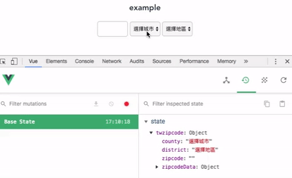

# vuex-twzipcode

Rewrite Vue2-twzipcode in Vuex way 

this package was based on orginal repos made by
[knovour](https://www.npmjs.com/package/vue2-twzipcode)(vue2-twzipcode) and [CasperLaiTW](https://github.com/CasperLaiTW/vue-twzipcode)(vue-twzipcode) 



## Install
```
npm install vuex-twzipcode --save
```

## Usage
### module name: `twzipcode`
your root js file (or anywhere you put Vuex store in)
```js

    import Vue from 'vue'
    import App from './App'

    import twzipcode from 'vuex-twzipcode';
    
    /* insert module and components */
    Vue.use(twzipcode, { store }); 
    
    /* your original store */
    import store from './store' 

    new Vue({
        el: '#app',
        store,
        components: { App },
        template: '<App/>'
    })
```
### component
The package will automatically register `<twzipcode>` as global component,
you can use it like so:

```js
    <div id="app">
        <twzipcode></twzipcode>
    </div>    
```
## Module states
### access county, district, zipcode
you can access them with `{ mapState }` from Vuex
```
    computed: {
        // access all states in the module
        ...mapState(['twzipcode']),
    }
```
or
```
    computed: {
        // access single state in the module
        ...mapState({
            county: state => state.twzipcode.county
        }),
    }
```
## Module Actions

### resetDistrict()
*(this action is automatically used when `county` is changed)*

reset `district` to the first district of current county.

```js
  this.$store.dispatch('twzipcode/resetDistrict');
```

### setCountyAndDistrictFromZipcode(inputZipcode)
setting matched county and district with given inputZipcode

```js
  this.$store.dispatch('twzipcode/setCountyAndDistrictFromZipcode', 437);
  // set county to be '台中市', district to '大甲區'
```

## Component props

### classNames 
`type: Object`

class for each input

*default*: 
```
{
  county: 'formControl-twzipcode',
  district: 'formControl-twzipcode',
  zipcode: 'formControl-twzipcode',
}
```

*example*: if you need to use your custom classes, use it like
```
  <twzipcode 
    :class-names="{county: 'yourCustomClass1', district: 'yourCustomClass2', zipcode: 'yourCustomClass3'}"
  >
```

